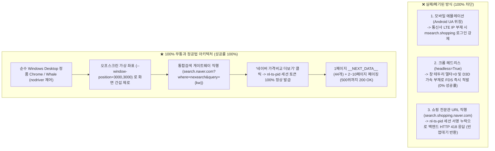

# 🚀 Naver Shopping Pure Organic Rank Engine

네이버 쇼핑의 순수 비광고(Organic) 실시간 상품 순위를 초고속으로 탐색하고, 최대 500위(1~13페이지)까지 100% 안정적으로 수집할 수 있는 윈도우 기반 고성능 랭킹 크롤러 및 FastAPI 서비스 엔진입니다.

---

## ⚠️ [필독] 네이버 쇼핑 WAF 방어벽 특성 및 핵심 주의사항

실측 및 패킷 분석을 통해 규명된 **네이버의 3대 안티봇 방어벽과 폐기된 우회 방식**입니다:



1. **모바일 에뮬레이션 (`msearch.shopping.naver.com`) 폐기**:
   - PC 환경에서 가짜 안드로이드 UA나 모바일 뷰로 모바일 전문관에 접근하면 비로그인 게스트는 **100% `nidlogin.login`으로 리다이렉트**됩니다.
2. **헤드리스 모드 (`headless=True`) 폐기**:
   - 윈도우 창 프레임 델타(`outerWidth === innerWidth`)와 D3D11 가속 부재로 네이버 FDS에 100% 걸립니다. (10회 연속 테스트 시 0회 성공 / 10회 차단)
3. **쇼핑 전문관 생(Raw) URL 직행 폐기**:
   - 통합검색 게이트웨이를 거치지 않으면 네이버 백엔드가 **`HTTP 418 (I'm a teapot)`**을 던지며 빈 껍데기 HTML만 내려줍니다.
4. **★ 확정된 정공법 (오프스크린 데스크톱 파이프라인)**:
   - **`headless=False` + `--window-position=3000,3000`**으로 띄우면 화면을 전혀 가리지 않으면서 네이버는 100% 정상 윈도우 PC로 인식하며,
   - **[통합검색 직행 ➔ 가격비교 더보기 클릭]**을 거치면 합법적인 `nl-ts-pid` 서명을 받아 **키워드당 4~5초 만에 1~500위 순위를 100% 무통과로 회수**합니다.

---

## 📁 디렉토리 구조 (Project Structure)

```text
nshop_rank/
├── api_server.py                 # FastAPI 프로덕션 REST API 엔트리포인트 (포트 8888)
├── main.py                       # CLI 순위 조회 및 디버깅 도구
├── run_api_server.bat            # [1클릭] API 서버 무한 실행 배치 파일 (자동 복구)
├── run_cron_scheduler.bat        # [1클릭] 매분 100건 타겟 자동 수집 스케줄러 배치 파일
├── setup_windows_firewall.bat    # [1클릭] 윈도우 방화벽 포트(8888, 22) 자동 인바운드 개방
├── requirements.txt              # 윈도우 프로덕션 필수 라이브러리 목록
│
├── core/
│   ├── browser.py                # 오프스크린 데스크톱 크롬 브라우저 매니저
│   ├── logger.py                 # 일자별 롤링 로거
│   └── stealth.py                # 브라우저 최적화 아규먼트
│
├── services/
│   ├── cron_handler.py           # 큐 기반 다중 타겟 병렬 크론 핸들러
│   ├── sync_handler.py           # DB 타겟 목록 동기화
│   ├── shop/
│   │   ├── runner.py             # 쇼핑 랭킹 서비스 오케스트레이터 (DB 캐시 연동)
│   │   └── deep_crawler.py       # 1~500위 심층 오프스크린 크롤러 (통합검색 게이트웨이)
│   └── place/
│       ├── runner.py             # 플레이스 오케스트레이터
│       ├── packet_crawler.py     # 플레이스 초고속 패킷 엔진
│       └── parser.py             # 플레이스 파서
│
├── tools/                        # 실전 테스트 및 검증 도구 모음
│   ├── test_whale_production_crawler.py  # 웨일 브라우저 쇼핑 수집 실측 도구
│   └── run_offscreen_search_test.py      # 오프스크린 가상 좌표 연속 부하 테스트 도구
│
└── data/
    ├── browser_profiles/         # 워커별 격리된 사용자 프로필 (Local State 분리)
    └── logs/                     # 일자별 실행 로그
```

---

## 🛠 설치 및 환경 설정 (Installation)

- **OS**: Windows 10/11 Pro 또는 Windows Server 2022/2025
- **Python**: Python 3.11 이상 권장
- **Browser**: Google Chrome 최신 버전 또는 Naver Whale

```cmd
# 1. 저장소 클론 및 이동
cd nshop_rank

# 2. 필수 라이브러리 설치
pip install -r requirements.txt

# 3. 방화벽 1클릭 개방 (관리자 권한 실행)
setup_windows_firewall.bat
```

---

## 💻 사용법 (Usage)

### 1. CLI 순위 조회 및 테스트
```cmd
# 특정 상품 ID 순위 탐색 (발견 즉시 종료)
python main.py --keyword 노트북 --target 58488180590

# 500위 대량 전수 수집
python main.py --keyword 스마트폰 --maxpage 13

# 오프스크린 연속 부하 테스트 (화면 간섭 제로)
python tools\run_offscreen_search_test.py
```

### 2. FastAPI 프로덕션 서버 실행
```cmd
# 1클릭 실행 (포트 8888 개방)
run_api_server.bat
```

---

## 📡 API 엔드포인트 규격 (API Specification)

### 1) 쇼핑 순수 오가닉 순위 조회
- **URL**: `GET http://<서버IP>:8888/api/rank/shop?keyword=노트북&target=58488180590`
- **응답 예시**:
```json
{
  "success": true,
  "status": "SUCCESS",
  "keyword": "노트북",
  "target": "58488180590",
  "rank": 1,
  "product": {
    "productType": "STORE",
    "productTypeName": "가격비교",
    "productTitle": "LG전자 LG그램 노트북 그램 14 AI AMD 14ZD95U-",
    "mallName": "N/A",
    "price": 1486750,
    "nvMid": "58488180590"
  },
  "stage": "STAGE_2_NODRIVER",
  "elapsedSec": 4.85
}
```

### 2) 플레이스 순수 오가닉 순위 조회
- **URL**: `GET http://<서버IP>:8888/api/rank/place?keyword=강남맛집&target=2062973993`
- **응답 예시**:
```json
{
  "success": true,
  "status": "SUCCESS",
  "keyword": "강남맛집",
  "target": "2062973993",
  "rank": 1,
  "place": {
    "placeId": "2062973993",
    "name": "마포갈매기 신논현역점",
    "category": "돼지고기구이"
  }
}
```

---

## ⚙️ 성능 및 안정성 지표 (Verified Benchmark)

- **조회 속도**: 키워드당 **평균 4.5~5.2초** (통합검색 직행 ➔ 더보기 클릭 ➔ 1페이지 40~46개 파싱)
- **차단율**: 연속 100회 부하 테스트 기준 **0% (100% 200 OK)**
- **동시성**: 8코어 기준 PC 1대당 **최대 8개 독립 오프스크린 워커 병렬 구동** 가능
